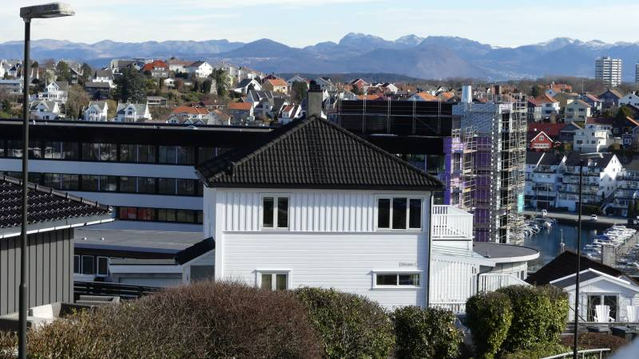

# Hva slags sted skal Paradis være?

Viser til Stavanger kommune [høring om utviklingen på Paradis området](https://www.stavanger.kommune.no/samfunnsutvikling/planer/reguleringsplaner/store-planoppgaver/paradis/#n-er-planprogrammet-p-h-ring-). Jeg bor på Våland så blir sterkt påvirket av hva som skjer på Paradis området. Derfor har jeg stor interesse i å gi meningen min og dele den med kommunen. 

Nedenfor er spørmålene lagt av kommunen, følgt av meningene mine. 

## Har du innspill til visjon for utviklingen av Paradis-området?

 - Ingen høyhus. Se for eksempel [Lagårdsveien 80](https://goo.gl/maps/vCJUjy7J4KetGPiH9) som hadde betydelig dårlig 
 påvirkning i utsykt fra husområde i sør ende til Musegata og Valkyrjegata mot Storhaug og Hillevågsvatnet. 
 
 - "Tett og godt", men ikke for tett. Viktig å beholde store, åpne og grønne plasser med god solforhold, spesielt rundt innsjøen.

 - "Prioritere gang, sykkel og kolektiv" - kjempe bra poenget!

 - "Gode koblinger til Paradis" - utfordrende men viktig poeng. Det må være flere koblingsmuliheter spesielt for fotgjengere og syklister fra Lagårdsveien og Østre Ring. Man kan ikke forvente at fotgjengere tar omveier på flere hundre meter til å nå tilgangspunkter. Som står nå på utkast side 29, det er ikke nok koblinger, se for eksempel fra Kiwi på Høylandsgata, et veldig travelt område, som skal også bli påvirket av utviklingen etter at sykkehuset flytter og da kan det bli enda travlere. Også viktig å ha en bro over vatnet eksklusivt for fotgjengere og syklister, og ikke bare sykkel eller fortau felt sammen med biler. Til slutt, koblingen til sykkelveien langs Gandsfjorden er også viktig.

- _more to come_

##  Har du innspill til de seks delmålene?
_Paradis som del av sentrum, Stedstilpasset byutviling, Paradis som nabolag og nærområde, Blågrønn spydspiss, Den gå - og sykkel-vennlige bydelen, Det klimavennlige og sirkulære Paradis_

_TBC_

## Hva tenker du at Paradisplanen kan bidra med i utviklingen av Stavanger sentrum og som nærområde?

_TBC_

## Andre innspill?

_TBC_

## Har du noen innspill til stedsanalysen?
_Stedanalysen er ikke formelt på høring, men vi tar veldig gjerne imot innspil til det videre arbeidet med stedanalysen!_

Angående visuelle forbindelser, den nylige ombygd høyblokken på Lagårdsveien 80 er en brutalt inngrep på området, spesielt for huser på sør ende av Musegata og Valkyrjegata. Jeg håper at dette ikke brukes som presedens for flere høyhus på Paradis.

_Høyhuset på Lagårdsveien 80 blokkerer utsikten over innsjøen, Storhaug og fjell for en rekke hus på Våland._

